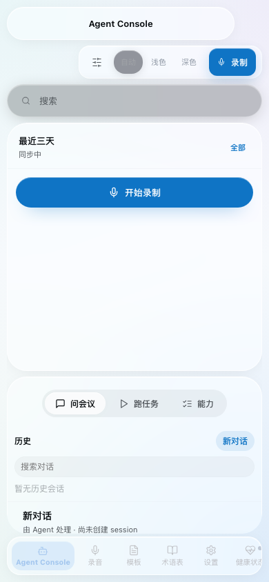

<div align="center">
  
  <h1>Yulu</h1>
  <p><b>Local meetings. Agent-native notes.</b></p>
  <a href="https://github.com/Nowhitestar/Yulu/stargazers"></a>
  <a href="https://github.com/Nowhitestar/Yulu/releases"></a>
  <a href="LICENSE"></a>
  <a href="#"></a>
  <p><b>English</b> · <a href="README.zh-CN.md">简体中文</a></p>
</div>

## Why

Yulu (语录, *yǔ lù*) is the Chinese word for "recorded sayings" — the genre that gave us *The Analects of Confucius* 2,500 years ago. It is the oldest answer to a problem we still have today: someone said something important in a room, and nobody wrote it down well enough to remember it.

Yulu is a local-first, agent-first meeting recorder for macOS. It captures meetings natively, transcribes them locally with MLX Whisper or `whisper.cpp`, then lets the agent you already use (Codex CLI, Claude Code, Hermes, OpenClaw…) handle the AI work: asking across meetings, summarizing with templates, and sending notes to Notion or Zulip through that agent's own connectors.

No virtual audio device. No cloud transcription. No account. Audio and transcripts stay on your laptop unless you explicitly send a note somewhere.

Compared to Otter / Granola / Fireflies:

- **System audio is captured natively** through `ScreenCaptureKit`, not through BlackHole or a multi-output device.
- **Transcription is fully local** — MLX Whisper on Apple Silicon, or `whisper-cli` (whisper.cpp) with your own model file. Chinese works as well as English.
- **Agent Console is the main workspace.** Start recording, watch the last three days of meeting tasks, ask across local meeting history, and switch the underlying agent from one place.
- **The AI layer is bring-your-own-agent.** Yulu writes work into a local queue or starts an agent session; the selected agent reads transcripts, templates, terminology, memory, and connector context, then writes back the result. Nothing is hard-coded to one vendor.
- **Connector capability follows the agent.** Notion, Zulip, and calendar context are shown as agent capabilities. Yulu stores the local filter and destination choices, while configuration still belongs to the selected agent.
- **Half-duplex mixing** keeps remote speakers crisp: system audio leads while others speak, microphone takes over during system silence.
- **Local web UI at `http://127.0.0.1:7777/agent-console`** — Agent Console, recordings, templates, glossary, settings, and daemon health. See [docs/yulu_ui.md](docs/yulu_ui.md).

## See it

<p align="center">
  
</p>

<table>
<tr>
  <td align="center" width="50%">
    
    <br><b>Agent Console adapts to smaller screens</b>
    <br><sub>Recording, Ask Meeting, sessions, and capability panels collapse without changing the model.</sub>
  </td>
  <td align="center" width="50%">
    <b>What lives in the console</b>
    <br><sub>Recent meeting tasks keep their state for three days. Ask Meeting creates persistent agent sessions. The capability panel shows the selected agent, summary templates, Notion, Zulip, calendar context, and local daemon health.</sub>
  </td>
</tr>
</table>

## Install

Latest stable release:

```bash
curl -fsSL https://raw.githubusercontent.com/Nowhitestar/Yulu/main/install.sh | bash
```

Specific version:

```bash
curl -fsSL https://raw.githubusercontent.com/Nowhitestar/Yulu/main/install.sh | bash -s -- --version v0.5.0
```

Dev channel from `main`:

```bash
curl -fsSL https://raw.githubusercontent.com/Nowhitestar/Yulu/main/install.sh | bash -s -- --dev
```

By default, the installer downloads the latest stable GitHub Release assets into `~/.yulu`; it does not clone `main`. The `--version` flag pins only that install operation, and `--dev` opts into the development channel.

The installer:

1. Checks macOS 13+, Xcode CLI Tools, Homebrew, Python 3.
2. Installs the selected Yulu runtime into `~/.yulu/` (a stable path — don't move it around).
3. Installs Homebrew packages: `sox`, `ffmpeg`, `whisper-cpp`, `terminal-notifier`, `gogcli`, `cloudflared`.
4. Writes per-user config to `~/.config/yulu/config.json` and creates `~/Movies/Yulu/` for recordings.
5. Compiles the window scanner; walks you through Accessibility permission.
6. Builds and signs `Yulu.app`; walks you through Microphone + Screen & System Audio Recording permissions.
7. Lets you choose the transcription profile: MLX `large-v3`, MLX `large-v3-turbo`, or a `whisper.cpp` GGML model.
8. Lets you choose the stop-time pipeline: realtime transcript → polish → summary, or full final transcription → summary.
9. Lets you choose the default agent provider for AI work: Codex CLI, Claude Code, Hermes, OpenClaw, a custom command, or local fallback only.
10. (Optional) configures Google Calendar via `gog`.
11. Installs LaunchAgents for background services.
12. Installs the `yulu` CLI to `~/.local/bin/yulu`.
13. (Optional) registers Yulu as an **agent skill** so Claude Code / OpenClaw / Codex etc. can drive it from natural language.
14. Runs a smoke test.

After install, **add `~/.local/bin` to your PATH** if it isn't already, so `yulu` is on your shell:

```bash
echo 'export PATH="$HOME/.local/bin:$PATH"' >> ~/.zshrc && exec zsh
```

### Update

Latest stable release:

```bash
yulu update
```

Specific version:

```bash
yulu update --version v0.5.0
```

Dev channel from `main`:

```bash
yulu update --dev
```

Stable and specific-version updates download GitHub Release assets into `~/.yulu/`; `--dev` installs or updates from `main`. Either way, setup re-runs in idempotent upgrade mode. Already-granted TCC permissions are not re-prompted; OAuth is not redone; the whisper model isn't re-downloaded.

`--version` affects only that one operation. The next plain `yulu update` returns to the latest stable release.

### Uninstall

```bash
yulu uninstall
```

Stops services, removes LaunchAgents and the CLI, and asks before deleting recordings / config / agent skills. macOS TCC entries and Homebrew packages are deliberately left alone (other apps may use them) — see the final summary printed by the script for the manual cleanup steps.

### `yulu` CLI

| Command | What |
|---|---|
| `yulu setup` | Re-run the installer interactively (fresh install) |
| `yulu update [--version vX.Y.Z \| --dev]` | Update from latest stable release assets, a specific version, or the dev channel |
| `yulu start` / `stop` / `restart` | Control the four LaunchAgents |
| `yulu version` | Print Yulu version, git commit, tag, and dirty state |
| `yulu status` | Service health, audio_daemon socket, recent recordings |
| `yulu doctor` | Config, daemon, model, queue, calendar health check |
| `yulu logs [name]` | Tail logs (default: `audio_daemon`) |
| `yulu record start "<title>"` / `yulu record stop` | Manual recording with the same stop → transcribe → summarize flow as the floating window |
| `yulu transcription status` | Show transcription engine and post-recording mode |
| `yulu transcription mode fast\|full` | Switch between realtime transcript → polish → summary and full final transcription → summary |
| `yulu transcription engine mlx <model>` | Use MLX Whisper, e.g. `mlx-community/whisper-large-v3-mlx` |
| `yulu transcription engine whisper <path>` | Use a local whisper.cpp GGML model |
| `yulu mcp status` / `install` / `remove` / `rotate-token` / `test` | Manage the local HTTP MCP registration for Codex, Claude Code, OpenClaw, and Hermes |
| `yulu where` | Print all the relevant paths on disk |
| `yulu uninstall` | See above |

### Use Yulu from your coding agent

Yulu ships with a `SKILL.md` under [`skills/yulu/`](skills/yulu/SKILL.md) that teaches Claude Code, OpenClaw, Codex, Cursor, and the [50+ other agents supported by `vercel-labs/skills`](https://github.com/vercel-labs/skills#supported-agents) how to drive it. Once installed, you can say things like:

- "Start recording, call it Yulu weekly"
- "Stop the recording and summarize it"
- "What did we talk about in last Tuesday's standup?"

`setup.sh` asks whether to install it and which agents to target. To install or reinstall it later, from anywhere:

```bash
# Install globally to the agents you choose
npx skills add Nowhitestar/Yulu -g -a claude-code -y
npx skills add Nowhitestar/Yulu -g -a codex -y

# Or install from your local clone
npx skills add . -g -a claude-code -y
```

The skill is a thin contract — it tells the agent what verbs Yulu exposes (start, stop, status, summary fulfillment) and how to find past meetings on disk. Yulu's macOS app, launchd services, and local transcription dependencies still come from `setup.sh`. Installing the skill alone does not capture audio.

Yulu also exposes a local token-protected MCP endpoint at `http://127.0.0.1:7777/mcp`. Install/update registers it with detected local agents automatically; run `yulu mcp status` or `yulu mcp test` to inspect it.

## How it works

```text
Agent Console
          ↓
 selected agent provider + capability filter
          ↓
 Codex CLI / Claude Code / Hermes / OpenClaw sessions
          ↓
 Ask Meeting history · Summary jobs · Notion/Zulip sends

Google Calendar / Window Detector
          ↓
 schedule.json  ──►  scheduler_daemon.py
          ↓
 meeting_daemon.py  ──►  notify.py prompt: "Start recording?"
          ↓
 record_audio.py  ──►  Yulu.app  (Unix socket)
          ↓
 ScreenCaptureKit (system audio) + AVFoundation (microphone)
          ↓
WAV  ──►  realtime_transcribe.py / transcribe.py  ──►  MLX Whisper or whisper-cli
          ↓
 transcript.txt  +  summary_request  ──►  agent-queue.json
          ↓
 selected agent session  ──►  summary.md / connector send
```

Six numbers worth knowing:
- WAV is 16-bit stereo 48 kHz.
- ScreenCaptureKit Float32 planar → interleaved stereo Int16.
- Half-duplex crossfade kicks in below `silence_threshold` (default 0.01).
- Default quality profile: MLX `mlx-community/whisper-large-v3-mlx` on Apple Silicon; whisper.cpp `ggml-large-v3.bin` is the non-MLX quality profile.
- Bundle id: `com.yulu.audiodaemon` (signed; falls back to ad-hoc).
- Agent queue: `~/.config/yulu/agent-queue.json`.

## macOS Permissions

| Component | Permission | Why |
|---|---|---|
| `Yulu.app` | Microphone | Record your local microphone |
| `Yulu.app` | Screen & System Audio Recording | Capture system audio with ScreenCaptureKit |
| `window_scanner` | Accessibility | Read window titles to detect meetings |

If system audio is missing: System Settings → Privacy & Security → **Screen & System Audio Recording** → enable `Yulu.app`, then restart it.

## Configuration

Path: `~/.config/yulu/config.json`

```json
{
  "audio": {
    "backend": "daemon",
    "silence_threshold": 0.01,
    "silence_duration_sec": 300,
    "half_duplex": true
  },
  "transcription": {
    "post_recording_mode": "fast_summary",
    "final_engine": "mlx",
    "mlx": {
      "python": "~/.config/yulu/venv-mlx-whisper/bin/python",
      "model": "mlx-community/whisper-large-v3-mlx"
    },
    "realtime": {
      "engine": "mlx",
      "mlx_model": "mlx-community/whisper-large-v3-mlx",
      "chunk_sec": 60
    },
    "whisper_cli": "whisper-cli",
    "local_model_path": "~/.config/yulu/models/ggml-large-v3.bin",
    "language": "zh"
  },
  "llm": {
    "enabled": true,
    "command": null,
    "agent": {
      "provider": "auto"
    }
  },
  "agent_console": {
    "plugins": {
      "added": ["summary", "notion", "zulip", "calendar"]
    },
    "destinations": {
      "codex": {
        "notion": { "target": "Yulu Meeting" },
        "zulip": { "stream": "product", "topic": "meeting-notes" }
      }
    }
  }
}
```

- `audio.backend = "daemon"` is the default. `mic_device` / `system_audio_device` only apply to the legacy SoX fallback.
- `transcription.post_recording_mode = "fast_summary"` uses the realtime transcript generated during the meeting, then polishes and summarizes it. Use `yulu transcription mode full` when you want a slower full-audio final transcription before summarization.
- `transcription.final_engine = "mlx"` is best on Apple Silicon. Use `mlx-community/whisper-large-v3-mlx` for highest quality, `mlx-community/whisper-large-v3-turbo` for speed. Use `final_engine = "whisper"` with `local_model_path` for the simpler non-MLX route.
- `llm.agent.provider = "auto"` chooses the first available agent CLI in this order: Codex, Claude Code, Hermes, OpenClaw. Set it explicitly when you want Yulu to follow one provider.
- Leave `llm.command` empty for the native provider path. To call a custom agent/LLM wrapper directly, set `llm.command` to any CLI that accepts a prompt on stdin and writes Markdown to stdout.
- `agent_console.plugins.added` is a Yulu-side filter. A plugin appears in the console only after it is added there; its configured/unconfigured state still comes from the selected agent.
- `agent_console.destinations` stores per-agent send targets such as the Notion page/database label and Zulip stream/topic. The connector credentials remain in the agent/plugin, not in Yulu.

Full config reference: [`docs/configuration.md`](docs/configuration.md).
Manual commands and troubleshooting: [`docs/operations.md`](docs/operations.md).

## Design notes

A few decisions are load-bearing and worth understanding before contributing:

- **No virtual audio device.** ScreenCaptureKit was added in macOS 13 specifically so apps could capture system audio without driver hacks. Yulu refuses to fall back to BlackHole even when it would be easier — the install friction is the whole point.
- **Recording always asks first.** Detection is best-effort, but consent is not. Every recording goes through `notify.py` with a real prompt.
- **The agent is the intelligence layer.** Yulu owns local capture, transcription, storage, and task state. The selected agent owns LLM reasoning and connector access. Yulu should not make you configure Notion, Zulip, or calendar twice.
- **State lives in JSON files, not RAM.** `agent-queue.json`, `schedule.json`, recordings on disk. Queue writes are locked and atomic; a power outage mid-meeting loses the audio after the last flush, nothing else.
- **One-binary security boundary.** Only `Yulu.app` holds the TCC permissions. The Python side talks to it through a Unix socket and cannot bypass macOS privacy on its own.
- **Cross-platform work is a boundary project.** macOS remains the shipped capture arm, while service, path, permission, dependency, agent-provider, and connector seams keep platform and cloud choices explicit. See [`docs/ARCHITECTURE.md`](docs/ARCHITECTURE.md).

## Background

I take a lot of meetings — internal reviews, customer calls, recordings of talks I want to revisit a month later. Granola does not record system audio. Otter is cloud-only and weak in Chinese. Every "just install BlackHole" guide ended with two output devices, no Bluetooth headphones, and a confused friend on the other end.

So I wrote my own. The first version was 200 lines of `sox` and a prayer. The version you are looking at uses ScreenCaptureKit, mixes half-duplex audio inline, and lets a local Claude Code agent finish the meeting note while I am already in the next one. The name *Yulu* (语录) is the promise: every conversation deserves to land somewhere you can re-read it later.

## Project layout

```text
Yulu/
├── install.sh                            # one-line installer entry
├── README.md
├── LICENSE
├── CONTRIBUTING.md
├── CHANGELOG.md
├── docs/
│   ├── configuration.md
│   └── operations.md
├── assets/
│   ├── logo.svg
│   └── demos/
├── skills/
│   └── yulu/SKILL.md                     # agent contract installed by `npx skills add`
└── yulu/
    ├── SKILL.md                          # internal architecture / developer doc
    └── scripts/
        ├── setup.sh                      # interactive installer (--upgrade for re-runs)
        ├── uninstall.sh                  # invoked by `yulu uninstall`
        ├── yulu                          # CLI dispatcher (symlinked to ~/.local/bin/yulu)
        ├── Yulu.app/                     # signed (or ad-hoc) audio daemon bundle
        ├── audio_daemon.swift            # ScreenCaptureKit + AVFoundation
        ├── build_audio_daemon.sh         # build & sign Yulu.app
        ├── record_audio.py               # recording control
        ├── meeting_daemon.py             # workflow orchestration
        ├── scheduler_daemon.py           # calendar-based scheduler
        ├── meeting_detector.py           # window-based detector
        ├── window_scanner.swift          # Accessibility window scanner
        ├── recorder_status.swift         # floating status window
        ├── transcribe.py                 # MLX / whisper transcription + agent queue writer
        ├── agent_notify.py               # agent queue helper
        ├── notify.py                     # macOS notifications & prompts
        ├── send_summary.py               # experimental Telegram / Notion / Zulip adapters
        ├── summary_template.md           # default meeting note template
        └── com.yulu.*.plist              # LaunchAgent definitions
```

After installing, the on-disk layout looks like:

| Path | Contents |
|---|---|
| `~/.yulu/` | Installed runtime from release assets or the dev channel |
| `~/.config/yulu/config.json` | User configuration |
| `~/.config/yulu/models/ggml-*.bin` | Downloaded whisper.cpp models |
| `~/.config/yulu/audio_daemon.sock` | Unix socket exposed by the daemon |
| `~/.config/yulu/agent-queue.json` | Pending events for your agent |
| `~/Movies/Yulu/` | Your meeting recordings + transcripts + summaries |
| `~/Library/LaunchAgents/com.yulu.*.plist` | Background services (4 LaunchAgents) |
| `~/.local/bin/yulu` | The CLI symlink |

## Support

- If Yulu helped you, star the repo or share it.
- Ideas, bugs, edge-case meetings: open an issue or PR. See [CONTRIBUTING.md](CONTRIBUTING.md).
- Security disclosures: please email rather than open a public issue.

## License

MIT. See [LICENSE](LICENSE).

`whisper.cpp`, `ScreenCaptureKit`, `AVFoundation`, `terminal-notifier`, `cloudflared`, and `gog` retain their own licenses.
