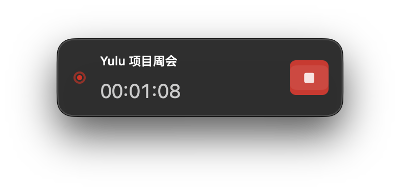
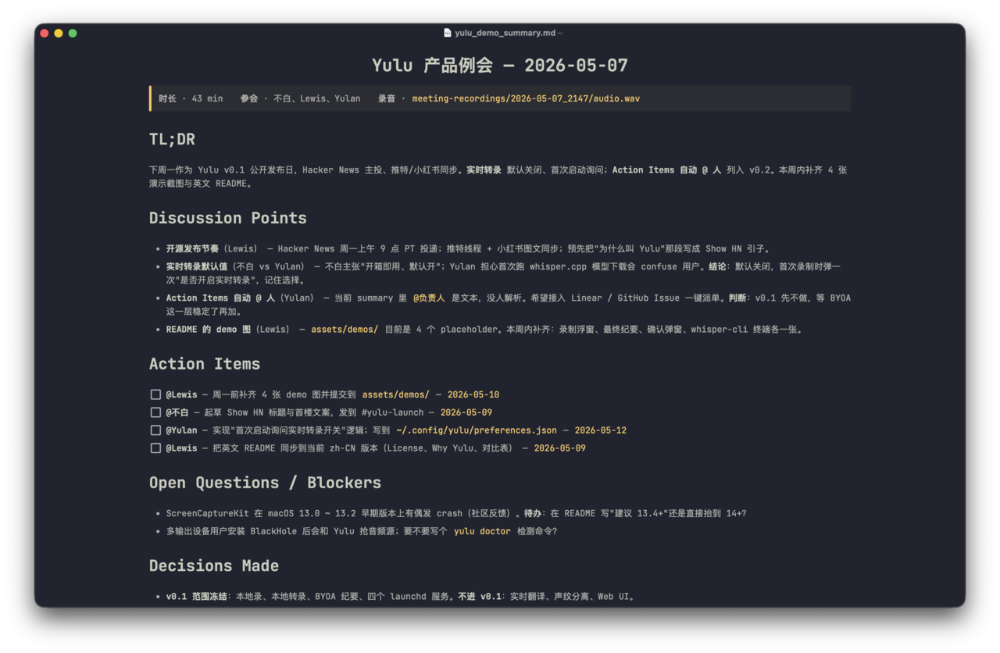
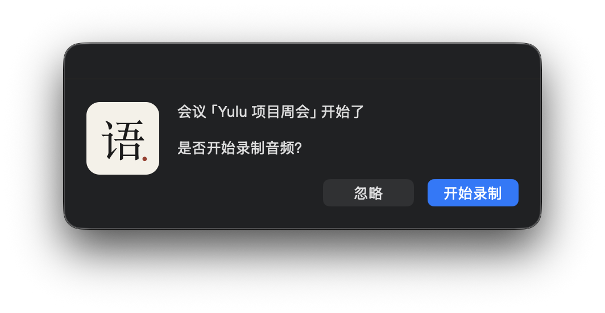
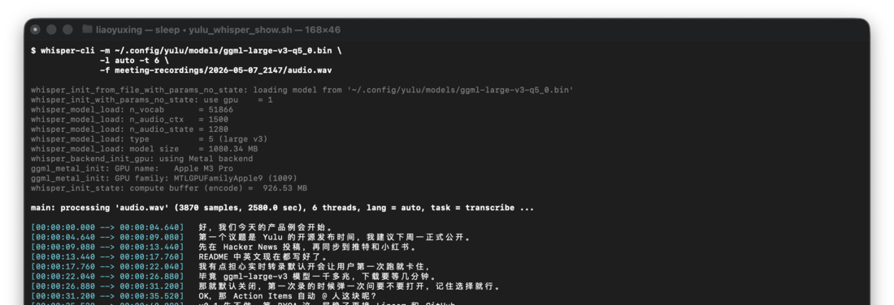

<div align="center">
  
  <h1>Yulu</h1>
  <p><b>Listen quietly. Capture everything.</b></p>
  <a href="https://github.com/Nowhitestar/Yulu/stargazers"></a>
  <a href="https://github.com/Nowhitestar/Yulu/releases"></a>
  <a href="LICENSE"></a>
  <a href="#"></a>
  <p><b>English</b> · <a href="README.zh-CN.md">简体中文</a></p>
</div>

## Why

Yulu (语录, *yǔ lù*) is the Chinese word for "recorded sayings" — the genre that gave us *The Analects of Confucius* 2,500 years ago. It is the oldest answer to a problem we still have today: someone said something important in a room, and nobody wrote it down well enough to remember it.

Yulu is a native macOS meeting recorder that listens to your meetings, transcribes them locally with `whisper.cpp`, and hands the transcript to any coding agent (Claude Code, Codex, OpenClaw…) to produce a clean meeting note. No virtual audio device. No cloud transcription. No account. The audio never leaves your laptop unless you tell it to.

Compared to Otter / Granola / Fireflies:

- **System audio is captured natively** through `ScreenCaptureKit`, not through BlackHole or a multi-output device.
- **Transcription is fully local** — `whisper-cli` (whisper.cpp) with your own model file. Chinese works as well as English.
- **The summary step is bring-your-own-agent.** Yulu writes a `summary_request` into a JSON queue; whichever agent you trust reads the transcript and the template, and writes back a polished `summary.md`. Nothing is hard-coded to one vendor.
- **Half-duplex mixing** keeps remote speakers crisp: system audio leads while others speak, microphone takes over during system silence.

## See it

<table>
<tr>
  <td align="center" width="50%">
    
    <br><b>Recording status</b>
    <br><sub>A small floating window with a manual stop button</sub>
  </td>
  <td align="center" width="50%">
    
    <br><b>Final summary</b>
    <br><sub>TL;DR · Discussion Points · Action Items · Decisions</sub>
  </td>
</tr>
<tr>
  <td align="center" width="50%">
    
    <br><b>Prompt before recording</b>
    <br><sub>Yulu always asks before it starts listening</sub>
  </td>
  <td align="center" width="50%">
    
    <br><b>Local transcription</b>
    <br><sub>whisper-cli runs offline; Chinese / English / mixed</sub>
  </td>
</tr>
</table>

> Demo assets live under [`assets/demos/`](assets/demos/). Replace the placeholder PNGs with your own captures before publishing.

## Install

```bash
git clone https://github.com/Nowhitestar/Yulu.git
cd Yulu
bash yulu/scripts/setup.sh
```

The installer will:

1. Check macOS 13+, Homebrew, Python 3.
2. Install `sox`, `ffmpeg`, `whisper-cpp`, `terminal-notifier`, `gogcli`, `cloudflared`.
3. Write per-user config to `~/.config/yulu/config.json`.
4. Compile the window scanner and walk you through Accessibility permission.
5. Build and sign `Yulu.app`.
6. Walk you through Microphone + Screen & System Audio Recording permissions.
7. (Optional) configure Google Calendar via `gog`.
8. Install LaunchAgents for background services.
9. Run a basic smoke test.

> `setup.sh` requires the full repository — do not run via `curl | bash`.

## How it works

```text
Google Calendar / Window Detector
          ↓
 schedule.json  ──►  scheduler_daemon.py
          ↓
 meeting_daemon.py  ──►  notify.py prompt: "Start recording?"
          ↓
 record_audio.py  ──►  Yulu.app  (Unix socket)
          ↓
 ScreenCaptureKit (system audio) + AVFoundation (microphone)
          ↓
 WAV  ──►  transcribe.py  ──►  whisper-cli
          ↓
 transcript.txt  +  summary_request  ──►  agent-queue.json
          ↓
 Any agent (Claude Code / Codex / OpenClaw…)  ──►  summary.md
```

Six numbers worth knowing:
- WAV is 16-bit stereo 48 kHz.
- ScreenCaptureKit Float32 planar → interleaved stereo Int16.
- Half-duplex crossfade kicks in below `silence_threshold` (default 0.01).
- Default whisper model: `ggml-medium.bin`.
- Bundle id: `com.yulu.audiodaemon` (signed; falls back to ad-hoc).
- Agent queue: `~/.config/yulu/agent-queue.json`.

## macOS Permissions

| Component | Permission | Why |
|---|---|---|
| `Yulu.app` | Microphone | Record your local microphone |
| `Yulu.app` | Screen & System Audio Recording | Capture system audio with ScreenCaptureKit |
| `window_scanner` | Accessibility | Read window titles to detect meetings |

If system audio is missing: System Settings → Privacy & Security → **Screen & System Audio Recording** → enable `Yulu.app`, then restart it.

## Configuration

Path: `~/.config/yulu/config.json`

```json
{
  "audio": {
    "backend": "daemon",
    "silence_threshold": 0.01,
    "silence_duration_sec": 300,
    "half_duplex": true
  },
  "transcription": {
    "whisper_cli": "whisper-cli",
    "local_model_path": "~/Models/whisper/ggml-medium.bin",
    "language": "zh"
  },
  "llm": {
    "enabled": true
  }
}
```

- `audio.backend = "daemon"` is the default. `mic_device` / `system_audio_device` only apply to the legacy SoX fallback.
- Leave `llm` empty to delegate summarization to your agent. To call an external LLM directly, set `llm.command` to any CLI that accepts a prompt on stdin and writes Markdown to stdout (e.g. `["claude", "--print", "--model", "claude-opus-4-7"]`).

Full config reference: [`docs/configuration.md`](docs/configuration.md).
Manual commands and troubleshooting: [`docs/operations.md`](docs/operations.md).

## Design notes

A few decisions are load-bearing and worth understanding before contributing:

- **No virtual audio device.** ScreenCaptureKit was added in macOS 13 specifically so apps could capture system audio without driver hacks. Yulu refuses to fall back to BlackHole even when it would be easier — the install friction is the whole point.
- **Recording always asks first.** Detection is best-effort, but consent is not. Every recording goes through `notify.py` with a real prompt.
- **The LLM is a plug-in, not a dependency.** `transcribe.py` runs all the way to a usable Markdown summary even if no agent ever shows up — `fallback_summary()` uses regex bucketing on the transcript so you never see "TODO: agent will fill this in".
- **State lives in JSON files, not RAM.** `agent-queue.json`, `schedule.json`, recordings on disk. A power outage mid-meeting loses the audio after the last flush, nothing else.
- **One-binary security boundary.** Only `Yulu.app` holds the TCC permissions. The Python side talks to it through a Unix socket and cannot bypass macOS privacy on its own.

## Background

I take a lot of meetings — internal reviews, customer calls, recordings of talks I want to revisit a month later. Granola does not record system audio. Otter is cloud-only and weak in Chinese. Every "just install BlackHole" guide ended with two output devices, no Bluetooth headphones, and a confused friend on the other end.

So I wrote my own. The first version was 200 lines of `sox` and a prayer. The version you are looking at uses ScreenCaptureKit, mixes half-duplex audio inline, and lets a local Claude Code agent finish the meeting note while I am already in the next one. The name *Yulu* (语录) is the promise: every conversation deserves to land somewhere you can re-read it later.

## Project layout

```text
Yulu/
├── README.md
├── LICENSE
├── CONTRIBUTING.md
├── CHANGELOG.md
├── docs/
│   ├── configuration.md
│   └── operations.md
├── assets/
│   ├── logo.svg
│   └── demos/
└── yulu/
    ├── SKILL.md                          # Claude / OpenClaw skill manifest
    └── scripts/
        ├── setup.sh                      # interactive installer
        ├── migrate_to_yulu.sh            # one-shot upgrade for old meeting-assistant installs
        ├── Yulu.app/                     # signed (or ad-hoc) audio daemon bundle
        ├── audio_daemon.swift            # ScreenCaptureKit + AVFoundation
        ├── build_audio_daemon.sh         # build & sign Yulu.app
        ├── record_audio.py               # recording control
        ├── meeting_daemon.py             # workflow orchestration
        ├── scheduler_daemon.py           # calendar-based scheduler
        ├── meeting_detector.py           # window-based detector
        ├── window_scanner.swift          # Accessibility window scanner
        ├── recorder_status.swift         # floating status window
        ├── transcribe.py                 # whisper transcription + agent queue writer
        ├── agent_notify.py               # agent queue helper
        ├── notify.py                     # macOS notifications & prompts
        ├── send_summary.py               # optional Telegram / Notion / Zulip output
        ├── summary_template.md           # default meeting note template
        └── com.yulu.*.plist              # LaunchAgent definitions
```

## Upgrading from `meeting-assistant`

If you installed an earlier version when this project was called `meeting-assistant`, run the migration script once before re-running `setup.sh`:

```bash
bash yulu/scripts/migrate_to_yulu.sh
bash yulu/scripts/setup.sh
```

The migration script moves `~/.config/meeting-assistant/` → `~/.config/yulu/` and removes the old `com.meetingassistant.*` LaunchAgents. Because the AudioDaemon bundle id changed, **macOS will treat it as a new app and ask for Microphone and Screen Recording permissions again** — that re-grant is expected and unavoidable.

## Support

- If Yulu helped you, star the repo or share it.
- Ideas, bugs, edge-case meetings: open an issue or PR. See [CONTRIBUTING.md](CONTRIBUTING.md).
- Security disclosures: please email rather than open a public issue.

## License

MIT. See [LICENSE](LICENSE).

`whisper.cpp`, `ScreenCaptureKit`, `AVFoundation`, `terminal-notifier`, `cloudflared`, and `gog` retain their own licenses.
