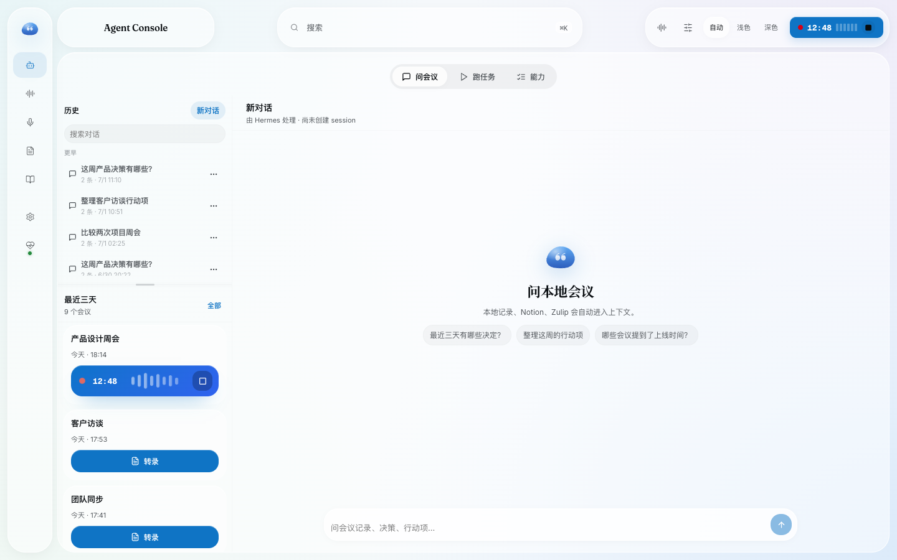
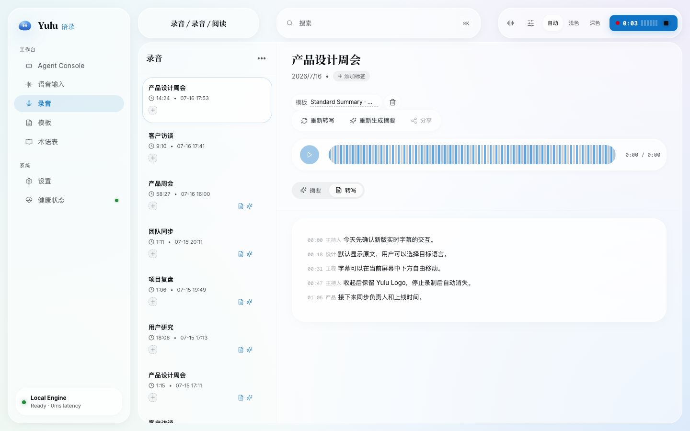

<div align="center">
  
  <h1>Yulu</h1>
  <p><b>Native meeting capture. Live captions. Agent-ready memory.</b></p>
  <a href="https://github.com/Nowhitestar/Yulu/stargazers"></a>
  <a href="https://github.com/Nowhitestar/Yulu/releases"></a>
  <a href="LICENSE"></a>
  
  <p><b>English</b> · <a href="README.zh-CN.md">简体中文</a></p>
</div>

Yulu (语录, *yǔ lù*) is a macOS meeting workspace built around local files and
the Agents you already use. It records system audio and microphone input without
a virtual audio device, shows movable realtime captions, turns meetings into
searchable transcripts and summaries, and lets Agents work across that history.

There is no Yulu account. Recordings and task state stay on your Mac. When Agent
processing is enabled, Yulu hands audio to Hermes; whether that processing stays
local or uses a remote provider depends on your Hermes configuration.

## What you can do

| Experience | What Yulu provides |
|---|---|
| Record a meeting | Native ScreenCaptureKit system audio plus AVFoundation microphone capture, started from the UI, menu bar, calendar/window detection, CLI, or MCP |
| Follow live captions | Movie-style captions on the active display, draggable from the bottom center, with source-only, bilingual, or translation-only display |
| Review every meeting | Audio playback, transcript, summary, tags, speaker corrections, templates, glossary terms, and local search in one recording library |
| Run each action explicitly | Re-transcribe, regenerate the summary, and share the summary are independent actions that can be repeated separately |
| Ask across meeting history | Agent Console combines local recordings with the selected general Agent and that Agent's own connectors |
| Speak instead of type | Global shortcuts provide dictation, quick translation, and voice questions that continue in Agent Console |
| Inspect the system | Settings and Health expose permissions, capabilities, durable tasks, daemons, scheduler state, and logs |

## Current interface

<p align="center">
  
</p>

Agent Console is the default workspace. Start or stop recording, see recent
meeting work, ask questions across local history, and inspect the selected
Agent's capabilities without leaving the page.

<p align="center">
  
</p>

The recording reader keeps the original audio, transcript, summary, and manual
actions together. Demo titles and transcript text in these screenshots are
synthetic.

## Realtime captions and translation

When recording starts, Yulu places pure movie-style subtitles near the bottom
center of the currently active display.

- Source text is the default.
- Choose a target language and switch between source-only, bilingual, and
  translation-only views while the meeting is live.
- Drag the six-dot handle to move the caption overlay anywhere on the display.
- The recording toolbar stays visible while you interact with it, then reduces
  to a centered red dot and “Recording” state after three seconds of inactivity.
- Hover the recording state to reveal “Click to stop”.
- Collapse the captions into the breathing Yulu quotation-mark logo; click the
  logo to restore them.
- When recording stops, the overlay disappears completely.

## Quick start

### Requirements

- macOS 13 or later.
- Apple Silicon (arm64) for official release installs.
- Python 3.10 or newer.
- A working Hermes CLI visible to Yulu's LaunchAgents for recording
  transcription, summaries, and voice input.
- Optionally, Codex CLI, Claude Code, OpenClaw, Hermes, or a custom command for
  Agent Console conversation.

The installer provisions a compatible Node.js runtime and Yulu's audio tools
when they are missing.

### Install

Latest stable release:

```bash
curl -fsSL https://raw.githubusercontent.com/Nowhitestar/Yulu/main/install.sh | bash
```

Then make sure the CLI is on your shell path:

```bash
echo 'export PATH="$HOME/.local/bin:$PATH"' >> ~/.zshrc
exec zsh
```

Yulu installs under `~/.yulu`, opens the setup flow, and guides you through the
three macOS permissions it needs:

| Component | Permission | Why |
|---|---|---|
| `Yulu.app` | Microphone | Capture your microphone |
| `Yulu.app` | Screen & System Audio Recording | Capture meeting playback with ScreenCaptureKit |
| `window_scanner` | Accessibility | Detect supported meeting windows and titles |

Open the local workspace at
[`http://127.0.0.1:7777/agent-console`](http://127.0.0.1:7777/agent-console),
or start your first recording from the menu bar or CLI:

```bash
yulu record start "Product weekly"
yulu record status
yulu record stop
```

### Install another channel

```bash
# One specific release
curl -fsSL https://raw.githubusercontent.com/Nowhitestar/Yulu/main/install.sh | bash -s -- --version v0.21.0

# Current main branch for development dogfood
curl -fsSL https://raw.githubusercontent.com/Nowhitestar/Yulu/main/install.sh | bash -s -- --dev
```

### Update or uninstall

```bash
yulu update                    # latest stable
yulu update --version v0.21.0  # one specific release
yulu update --dev              # current main branch
yulu uninstall
```

Updates preserve configuration, recordings, and macOS permissions. Stable
updates verify the published checksum before replacing the installed runtime.

## How Yulu works

```text
UI / menu bar / calendar / window detection / CLI / MCP
                         |
                         v
        Yulu.app native system + microphone capture
                         |
             +-----------+-----------+
             |                       |
             v                       v
      live captions          local WAV recording
      + translation                   |
                                      v
                            authenticated local Host
                                      |
                            durable task + lease + audit
                                      |
                                      v
                       Hermes transcription and summary
                                      |
                                      v
                   atomic transcript + summary commit
                                      |
                         optional authorized sharing

Agent Console -> selected general Agent -> that Agent's connectors
```

The split is intentional:

- **Yulu** owns native capture, permissions, local files, durable task state,
  artifact commits, recovery, and authorization boundaries.
- **Hermes** owns recording transcription, summary generation, and explicitly
  authorized Notion delivery.
- **The selected general Agent** owns Agent Console conversation and its own
  connectors.

If the Host is unavailable when capture ends, Yulu atomically spools the
completion event and replays it after recovery without duplicating the automatic
task. See [Architecture](docs/ARCHITECTURE.md) for the full contract.

## CLI reference

| Command | Purpose |
|---|---|
| `yulu status` | Show service, capture-socket, recording, and UI health |
| `yulu doctor [--json]` | Diagnose permissions, Host tasks, search, and Agent capabilities |
| `yulu record start "<title>"` | Start a native meeting recording |
| `yulu record stop` / `status` | Stop capture or inspect the live recording state |
| `yulu dictate start\|stop\|once\|toggle\|ask` | Dictate, translate, or send a voice question to Agent Console |
| `yulu status-agent hotkeys` | Print global dictation, translation, and voice-chat shortcuts |
| `yulu search "<query>"` | Search local transcripts and summaries |
| `yulu prompts ...` / `yulu vocab ...` | Manage reusable instructions and glossary context |
| `yulu mcp status\|install\|remove\|rotate-token\|test` | Manage authenticated local MCP registration |
| `yulu skill install --agent <name>` | Install or refresh the Yulu Agent skill |
| `yulu logs [audio_daemon\|ui\|scheduler\|detector\|calendar]` | Tail a runtime log |
| `yulu start` / `stop` / `restart` | Control installed background services |
| `yulu where` / `version` | Print installed paths or version metadata |

Run `yulu help` for the complete command list.

## Agent integration

Yulu exposes loopback-only, bearer-authenticated MCP tools and resources for
recording control, meeting metadata, durable task status, local search, prompts,
glossary, health, and artifact workflows.

```bash
yulu skill install --agent codex
yulu skill install --agent claude-code
yulu mcp test
```

After installation, an Agent can handle requests such as:

- “Start recording and call it Product weekly.”
- “What decisions did we make in meetings last week?”
- “Regenerate the summary for this meeting, then share it.”

Installing the skill alone does not install the native app or transcription
pipeline. Install Yulu first, then add the skill to each Agent you want to use.

## Data and privacy

- WAV recordings are stored under `~/Movies/Yulu` by default.
- Transcript and summary sidecars live beside their recording.
- Runtime databases, task state, tokens, sockets, and logs stay under
  `~/.config/yulu`.
- The Host binds to loopback and protects completion, transcription, and MCP
  requests with a per-install bearer token.
- Yulu does not store Agent connector credentials.
- Automatic processing authorizes Yulu to hand audio to Hermes. The Hermes
  provider configuration determines whether processing is local or remote.
- External delivery requires explicit authorization; uncertain side effects are
  not blindly replayed.

See [Configuration](docs/configuration.md), [Operations](docs/operations.md),
and [Security](SECURITY.md) for exact controls and troubleshooting.

## Development

Yulu is macOS-first. Native capture and the system overlay are Swift, the local
Host and web UI are TypeScript, and Python handles capture orchestration,
scheduling, and macOS workflow glue.

```bash
python3 -m pytest -q

cd yulu/scripts/yulu_ui
npm test
npm run typecheck
npm run build
```

Install a checkout for local dogfood:

```bash
make dev-install
python3 yulu/scripts/doctor.py --json
curl -fsS http://127.0.0.1:7777/healthz
```

Contributor guides: [Development](docs/DEVELOPMENT.md),
[Web UI](docs/yulu_ui.md), [Branding](docs/branding.md), [Release](docs/RELEASE.md), and
[ADRs](yulu/spec/adr/README.md).

## License

MIT. See [LICENSE](LICENSE). Third-party tools and macOS frameworks retain their
own licenses.
