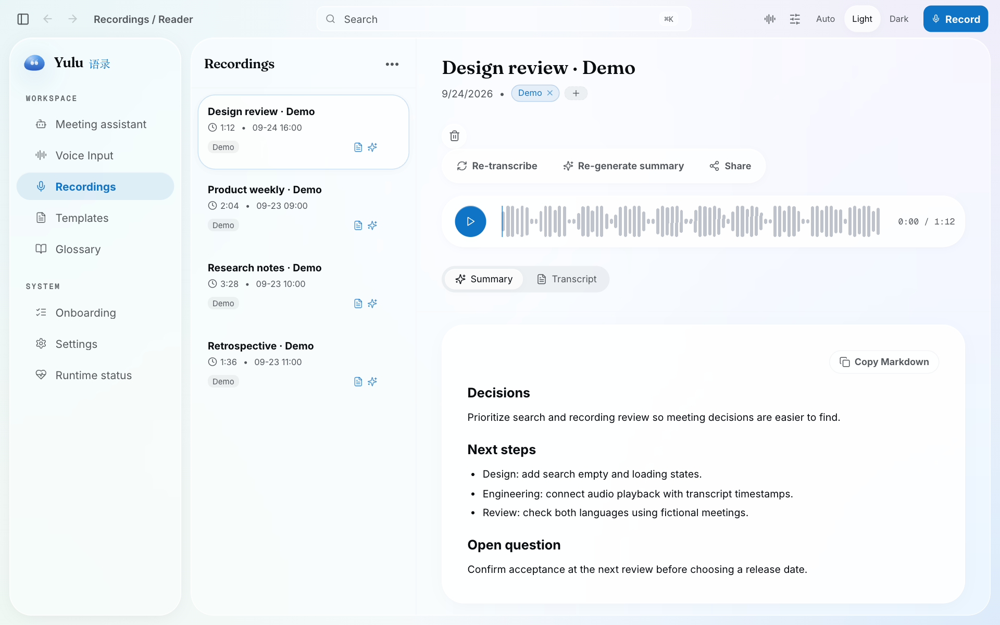
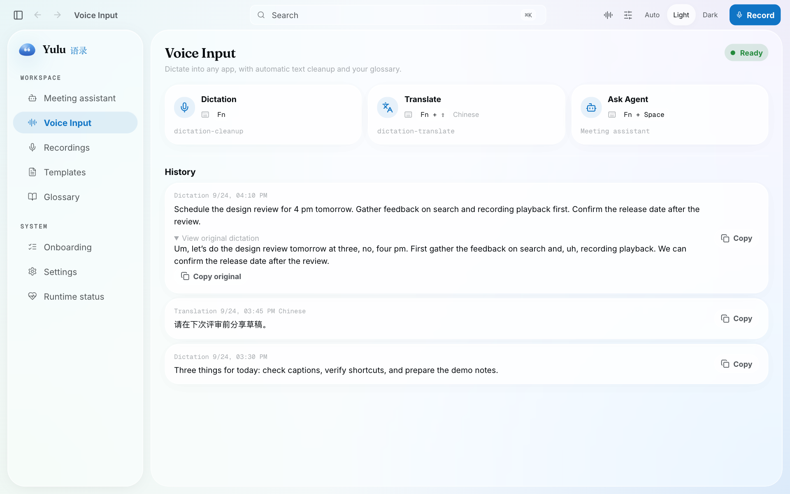

  
  <h1>Yulu</h1>
  
<b>Native meeting capture. Live captions. Agent-ready memory.</b>

  
<b>English</b> · <a href="README.zh-CN.md">简体中文</a>

  
<a href="https://github.com/Nowhitestar/Yulu/releases/latest">Download for macOS</a> · <a href="CHANGELOG.md">Changelog</a> · <a href="LICENSE">MIT License</a>

Yulu is a macOS workspace for meeting notes and voice input. Record system audio
and your microphone, find decisions in past meetings, or dictate into the app
you are using. No Yulu account or virtual audio device required.

## Design choices

- **Useful files you can keep.** Audio, plain-text transcripts, and Markdown
  summaries live on your Mac, ready to back up, move, and use in other tools.
- **Build on your existing AI workflow.** Choose transcription, summary, and
  conversation providers independently, including xAI, Codex, or Claude Code
  for summaries. Through [MCP](docs/operations.md#dmg-and-cli-entry-points),
  your Agent can also control recording and search meeting history.
- **Capture directly on your Mac.** System audio and microphone capture need
  no meeting bot or virtual audio device. Movable captions, bilingual
  translation, calendar reminders, and meeting detection support the workflow.
- **Voice input beyond meetings.** Dictate into your current app, translate,
  or ask a question with a global shortcut. Optional xAI cleanup has three
  editing levels and separate punctuation styles; the original text stays available.

The meeting library adds playback, search, tags, speaker corrections, templates,
and a glossary.

[What's new in v0.26.0](docs/release-notes/v0.26.0.md): improved dictation cleanup,
Fn shortcuts, a compact waveform panel, and cleaner live captions.

## Screenshots

**Meeting library and summaries**

**Voice input with original-text recovery**

*Screenshots use fictional demo data; no real meetings, accounts, or credentials.*

## Get started

Requires **macOS 13+ and Apple Silicon** for official releases.

1. Download the `.dmg` from [GitHub Releases](https://github.com/Nowhitestar/Yulu/releases/latest),
   drag **Yulu.app** into **Applications**, and open it.
2. Follow setup to grant microphone and system-audio access. Allow input control
   for global shortcuts and automatic text insertion.
3. Install the local speech model, or explicitly connect xAI for cloud
   transcription. Choose a summary provider if you want AI meeting notes.
4. Start a recording from the App or menu bar. Use **Fn** for dictation,
   **Fn+Shift** for translation, and **Fn+Space** for voice questions.

Settings let you customize shortcuts and hide the Dock and menu bar icons
independently. The App includes its runtime and supports in-app updates;
the DMG does not install a global `yulu` shell command.

## Privacy

- Recordings, transcripts, summaries, and history are stored locally. Recordings
  default to `~/Movies/Yulu`; local speech recognition stays on-device.
- Cloud features are opt-in: xAI transcription sends audio to xAI; AI summaries,
  translation, cleanup, and conversations can send text to the selected provider.
  Providers are selected explicitly, with no silent fallback.
- Sharing a summary requires a separate manual confirmation. Yulu stores its xAI
  credentials in macOS Keychain; Agent connector credentials stay with the Agent.

## More

[Configuration](docs/configuration.md) · [Troubleshooting & CLI](docs/operations.md) ·
[Agent skill](skills/yulu/SKILL.md) · [Development](docs/DEVELOPMENT.md) ·
[Architecture](docs/ARCHITECTURE.md) · [Security](SECURITY.md)
