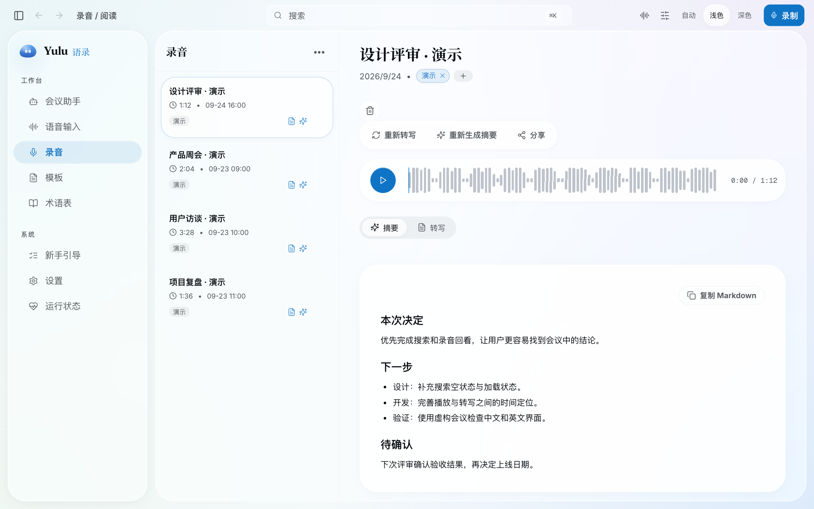
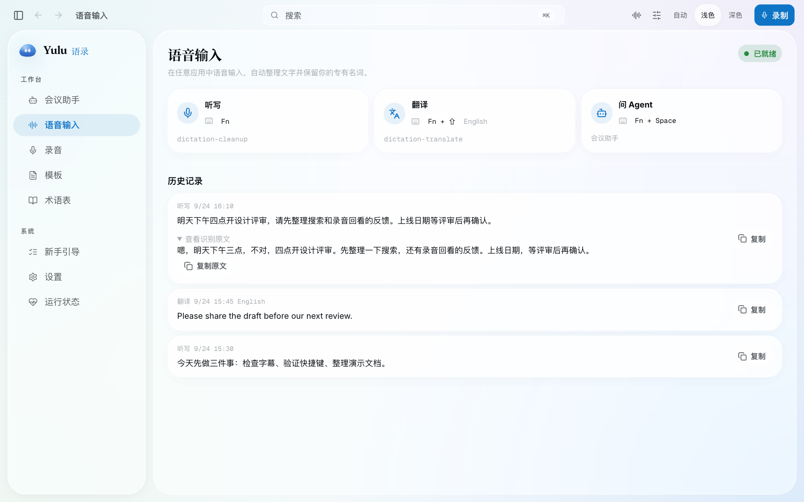

  
  <h1>Yulu · 语录</h1>
  
<b>原生录制，实时字幕，让每场会议成为 Agent 可用的记忆。</b>

  
<a href="README.md">English</a> · <b>简体中文</b>

  
<a href="https://github.com/Nowhitestar/Yulu/releases/latest">下载 macOS 版</a> · <a href="CHANGELOG.md">更新记录</a> · <a href="LICENSE">MIT 许可证</a>

Yulu 是 macOS 上的会议记录与语音输入工具。录制系统声音和麦克风，回查会议决策，
也能直接向当前应用听写输入。无需 Yulu 账号或虚拟声卡。

## 设计思路

- **本地文件，方便复用**：音频、TXT 转写和 Markdown 纪要直接保存在你的 Mac，便于备份、迁移和交给其他工具使用。
- **接入你已有的 AI 工作流**：转写、纪要和对话分别选服务；纪要支持 xAI、Codex 或 Claude Code。通过 [MCP](docs/operations.md#dmg-and-cli-entry-points)，Agent 也能控制录音、检索会议记录。
- **直接在 Mac 上采集**：录制系统声音和麦克风，无需机器人入会或虚拟声卡；配合可移动字幕、双语翻译、日历提醒和会议检测。
- **会议之外也能用**：全局快捷键支持向当前应用听写、快速翻译和语音提问。可选 xAI 三档文字整理，标点风格独立选择，整理结果与原文都保留。

会议资料库还支持播放、搜索、标签、说话人修正、纪要模板和术语表。

[v0.26.0 更新](docs/release-notes/v0.26.0.md)：优化听写整理，加入 Fn 系列快捷键，
缩小声波浮窗，并改善实时字幕显示。

## 界面

**会议资料库与纪要**

**语音输入与原文保留**

*截图全部使用虚构演示数据，不包含真实会议、账号或凭据。*

## 开始使用

正式版支持 **macOS 13+、Apple Silicon**。

1. 从 [GitHub Releases](https://github.com/Nowhitestar/Yulu/releases/latest) 下载 `.dmg`，将 **Yulu.app** 拖入「应用程序」后打开。
2. 按引导授予麦克风与系统音频权限；全局快捷键和自动输入还需要输入控制权限。
3. 安装本地语音模型，或明确连接 xAI 使用云端转写；需要 AI 纪要时，再选择纪要服务。
4. 从 App 或菜单栏开始录音；按 **Fn** 听写、**Fn+Shift** 翻译、**Fn+Space** 语音提问。

设置中可修改快捷键，也可分别隐藏 Dock 和菜单栏图标。App 自带运行环境，支持应用内更新；DMG 不会安装全局 `yulu` 终端命令。

## 隐私

- 录音、转写、纪要和历史记录保存在本机；录音默认位于 `~/Movies/Yulu`，本地语音识别不上传音频。
- 云端能力按需启用：xAI 转写会发送音频；AI 纪要、翻译、文字整理和对话可能向所选服务发送文本。服务由你明确选择，不会静默切换。
- 分享纪要需要单独手动确认。Yulu 的 xAI 凭据保存在 macOS 钥匙串，Agent 的连接器凭据由对应 Agent 保管。

## 更多

[配置](docs/configuration.md) · [排障与 CLI](docs/operations.md) ·
[Agent skill](skills/yulu/SKILL.md) · [开发](docs/DEVELOPMENT.md) ·
[架构](docs/ARCHITECTURE.md) · [安全说明](SECURITY.md)
