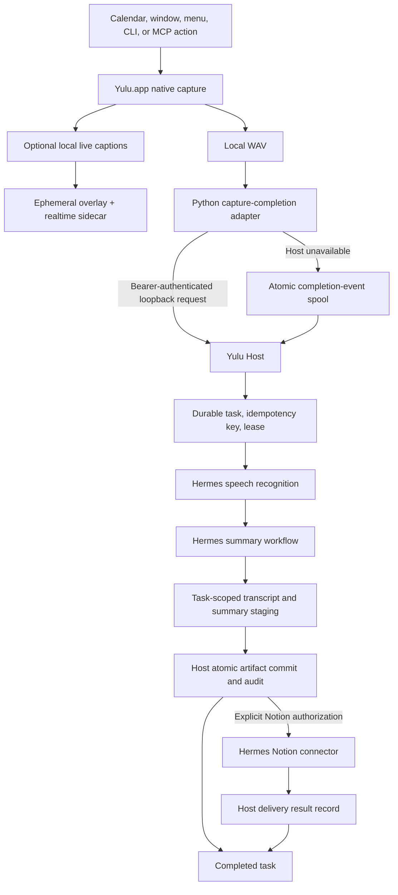
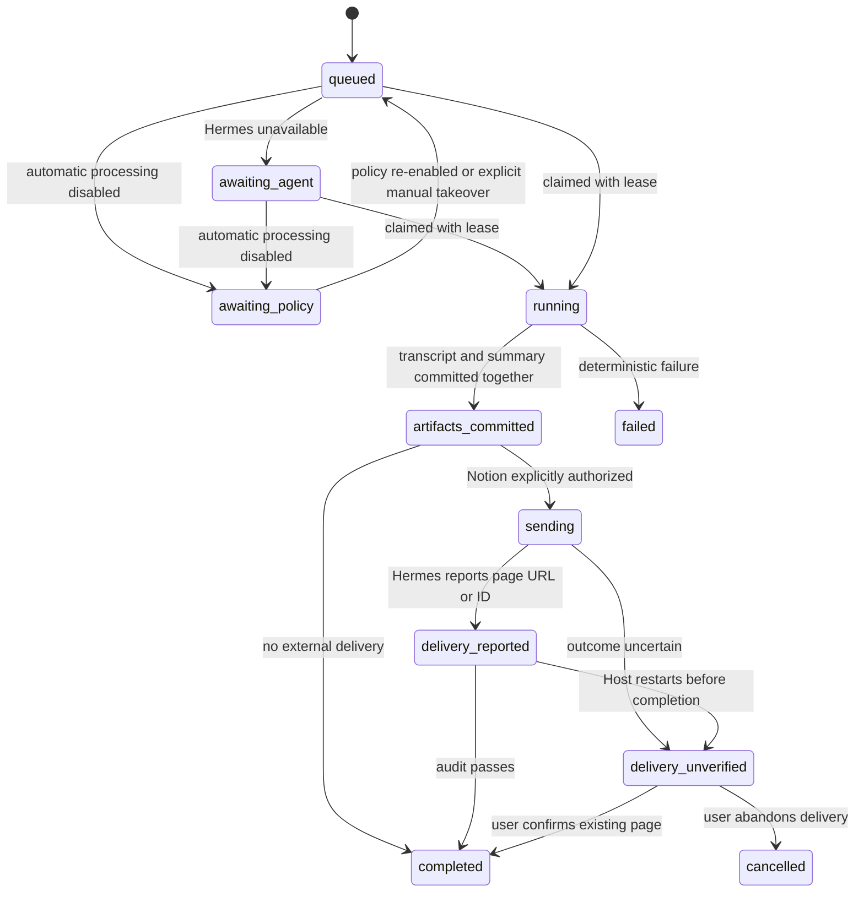

# Yulu Architecture

Yulu is a macOS-native recording product with a durable local Host and
Agent-owned intelligence. The current runtime decision is recorded in
[`ADR-005`](../yulu/spec/adr/005-agent-native-durable-recording-pipeline.md).

## Responsibility boundary

Yulu owns only the capabilities that require a trusted product boundary:

- native system-audio and microphone capture;
- optional, ephemeral low-latency captions whose audio and model stay local;
- macOS permission visibility and repair;
- recording path validation;
- durable tasks, idempotency, leases, recovery, and audit events;
- task-scoped staging, pair validation, atomic target replacement, and
  transactional artifact records;
- explicit authorization and recording of external delivery outcomes;
- local MCP authentication and access control.

Hermes owns the durable final speech recognition, summary generation, and Notion
delivery for the recording pipeline. The optional local caption engine owns only
mutable live display text and never becomes the final task artifact. The Agent
selected in Agent Console owns interactive conversation and its own connectors.
Yulu does not contain a general AI, chat, or connector execution engine.

## Runtime components

| Layer | Current owner | Contract |
|---|---|---|
| Native capture | `Yulu.app`, `audio_daemon.swift` | Capture through ScreenCaptureKit and AVFoundation; expose start/stop/status over `audio_daemon.sock` |
| Capture edge | `record_audio.py`, `meeting_daemon.py`, dictation/status adapters | Control native capture; submit a completed-recording event; atomically spool when Host is unavailable |
| Local Host | `yulu_ui/src/server.ts` | Loopback HTTP, tRPC, WebSocket, static UI, and authenticated MCP |
| Realtime caption engine | `localCaptionManager.ts`, `sherpa_caption_worker.py` | Optional local Paraformer INT8 worker for source-separated mutable captions; install/test/remove from Settings |
| Realtime coordinator | `realtimeTranscription.ts` | Feed mic/system streams, publish partial/stable captions, apply glossary corrections, and fall back to Agent-compatible chunks |
| Durable store | `hostStore.ts` | Persist tasks, events, leases, artifact records, and Notion delivery records in `host.sqlite` |
| Pipeline coordinator | `recordingPipeline.ts` | Validate input, enqueue/claim tasks, dispatch Hermes, enforce state transitions, and recover failures |
| Recording gateway | `agentGateway.ts` | Start a loopback Hermes service for audio, run the Hermes recording workflow, and audit its tool calls |
| Artifact boundary | `artifactStore.ts` | Validate task staging files and atomically commit transcript plus summary with hashes and provenance |
| General Agent runtime | `agentRuntime.ts`, Agent Console | Resolve Codex, Claude Code, Hermes, OpenClaw, or a configured command for conversation |
| Local context | prompt, glossary, search SQLite databases | Supply instructions and discoverable local data; never execute AI work |

The Host is part of the UI service, but “Host” refers to the trusted local
control plane, not just the browser interface.

## Recording flow



### Capture completion

`meeting_daemon.py` stops native capture and submits:

```json
{
  "audioPath": "/absolute/path/to/Meeting_YYYYMMDD_HHMMSS.wav",
  "title": "Meeting",
  "sendToNotion": false
}
```

The request goes to `POST /api/recordings/completed` on loopback with the local
bearer token. If the Host cannot be reached, the same payload is written with an
atomic rename under `~/.config/yulu/recording-events/`. The Host registers its
watcher before the startup scan and periodically rescans as a lost-event and
transient-failure fallback before replaying valid events.

### Admission and idempotency

The Host accepts only a real WAV inside the configured recordings directory,
with the filename contract `<title>_YYYYMMDD_HHMMSS.wav`. Automatic completion
uses a hash of the resolved path, size, and modification time as the idempotency
key. Re-delivering the same event returns the existing task. A manual reprocess
uses a new key because the user intentionally requested another run.

## Durable task model

`~/.config/yulu/host.sqlite` is the source of truth. A task records:

- recording stem, title, and validated audio path;
- idempotency key, automatic/manual trigger, and Agent provider;
- current state and semantic phase;
- current lease token and attempt number;
- summary instructions and Notion opt-in/destination hint;
- native Agent session identity and any error;
- append-only task events, committed artifact metadata, and delivery metadata.

Only the current lease holder may report progress, commit artifacts, authorize a
delivery, report a delivery, or complete the task. This prevents a stale Agent
attempt from committing after a retry has claimed the task.



On Host restart, interrupted local processing returns to `queued`. A task that
may already have contacted Notion becomes `delivery_unverified`; it is never
blindly replayed as if the side effect were known to have failed.
Likewise, policy-disabled dispatchable tasks move to `awaiting_policy`; the Host
does not claim them, and capture completion receives a permanent policy result
rather than creating a future implicit backlog. The global `enabled` switch also
disables manual work and on-demand transcription. The narrower
`auto_process_recordings` switch pauses only automatic work: dictation and manual
reprocessing remain available, and explicit manual takeover promotes the same
paused task instead of admitting a duplicate.

## Artifact commit boundary

Each task has a private Host-owned directory under
`~/.config/yulu/agent-tasks/<task-id>/`. The transcription transport stages
`transcript.txt`; Hermes never receives a general file tool or either path.
Instead, the artifact MCP exposes only task-scoped operations to:

- read the leased task transcript;
- stage the complete Markdown summary;
- commit the fixed `transcript.txt` and `summary.md` pair.

The Agent then calls the authenticated `recording_artifact_commit` MCP tool with
the task ID, lease, and provenance. The Host:

1. verifies both files exist, contain text, and are within size limits;
2. checks that the audio filename matches the task recording stem;
3. writes both final files with private permissions using temporary files and
   atomic rename;
4. records SHA-256, byte size, MIME type, provenance, and commit time;
5. advances the task only after both artifact records are stored.

Directly writing a final recording sidecar does not complete a task.

## Notion side-effect boundary

Notion is disabled per task unless `sendToNotion=true` was recorded at enqueue
time. Recording work uses two non-overlapping MCP servers:

- `/mcp/recording-artifact`, configured in Hermes as `yulu_artifact`, exposes
  only task get/progress, task-scoped transcript read, summary stage, and artifact
  commit;
- `/mcp/recording-delivery`, configured as `yulu_delivery`, exposes only task get,
  Host-verified committed-summary read, and Notion begin/commit boundaries.

The general `/mcp` server remains the full Yulu capability surface for interactive
Agents. The artifact session receives only `yulu_artifact`; it has neither `file`
nor any connector toolset. If delivery is authorized, the Host starts a new native
Hermes session with only `yulu_delivery,notion`. It never resumes the artifact
session containing raw-transcript context. The Host records and audits the two
native session IDs separately, then backfills artifact provenance with the actual
artifact session ID.

After artifacts are committed:

1. The Host validates the lease, opt-in, task state, and artifacts, then persists
   `sending` and the stable delivery key before giving the new Agent session any
   connector capability.
2. Hermes requests `recording_begin_notion_delivery` to confirm the authorization
   and receive any page identity already verified by an earlier delivery.
3. Hermes reads the summary through `recording_committed_summary_read`; the Host
   verifies the artifact row, expected path, byte count, and SHA-256 first.
4. If the Host returned an existing page URL/ID, Hermes updates exactly that page
   without search or create. Otherwise it searches the stable key
   (`yulu-<task-id>`) once, updates the single exact match, or creates one page
   only when the parsed search result is explicitly empty.
6. Hermes uses its own Notion connector and includes that key as an idempotency
   marker.
7. Hermes reports the destination and page URL or ID with
   `recording_commit_notion_delivery`.
8. The Host accepts completion only when the delivery session contains no extra
   connector calls, exactly one matching write, and a write result consistent
   with the reported URL or page ID.

The delivery identity is keyed by recording plus destination, not by whether the
task happens to be `completed` at lookup time. If a later local reprocessing
attempt fails before another external write, the next authorized send reuses the
reported task, page identity, and stable `yulu-<task-id>` key. An uncertain write
must instead be resolved through explicit confirm-or-abandon reconciliation;
normal retry cannot cross that boundary.

Yulu never reads Notion credentials and never treats Agent prose as proof that a
page was created. Completion also requires an exported Hermes session showing
either a direct update of the Host-verified page or a successful exact-marker
search branch, plus a Notion write result matching the reported page identity and
the Host calls in the required order.

## General Agent separation

The recording pipeline and interactive Agent Console are deliberately separate:

- `resolveHermesAgentRuntime()` resolves Hermes for recording and dictation.
- `resolveAgentRuntime()` resolves the configured or detected general Agent for
  conversation.
- Recording tasks remain Hermes-backed even when the general Agent is Codex,
  Claude Code, or OpenClaw.
- This boundary is fail-closed: if Hermes is unavailable, the task becomes
  `awaiting_agent`. The Host never falls back to the general Agent for recording
  speech or summaries.
- The general Agent's connector configuration stays with that Agent. Yulu may
  expose local recordings, search, prompts, glossary, health, and task tools, but
  it does not proxy arbitrary connector calls.

Connector ownership is partitioned by intent. Delivery of a recording's committed
artifacts to Notion always belongs to the leased Hermes recording task and uses
`agent_pipeline.notion_destination`, task opt-in, and the Host delivery key.
A Notion action requested inside an unrelated conversation belongs to the selected
general Agent and is not a recording delivery. The two paths must not silently
trigger one another.

## Python capture edge

Python remains useful for macOS workflow glue, but it is not an AI control plane.
Its runtime responsibilities are limited to:

- capture start/stop/status calls;
- meeting detection and scheduling around capture;
- dictation audio capture plus authenticated Host transport;
- completion-event delivery or durable local spooling;
- local clipboard, notification, and permission helpers.

Adding an Agent capability to Python is an architecture regression. New speech,
summary, conversation, or connector behavior belongs in Hermes or the selected
general Agent behind the existing Host contracts.

## Local Host security

The Host:

- binds to `127.0.0.1`;
- rejects Host headers other than localhost/loopback;
- requires a constant-time-checked per-install bearer token for MCP, completion,
  warm-up, and Agent transcription requests;
- accepts transcription paths only inside the recording or dictation roots;
- exposes audio files by basename from the configured recording directory;
- stores task workspaces and databases under the machine-local config root.

`GET /healthz` is intentionally unauthenticated and reports only process health.
It proves that the loopback Host is listening, not that Hermes or the recording
pipeline is healthy.

## Privacy boundary

Raw capture is local. Enabling automatic Agent processing authorizes Yulu to hand
audio to Hermes; Hermes' own provider determines whether that processing stays
on-device or uses a remote service. Documentation and UI must not describe this
as unconditionally local speech recognition.

Notion requires a separate per-task opt-in. Other interactive connector actions
belong to the general Agent and follow that Agent's own consent and credential
model. Yulu configuration must not contain connector secrets.

Runtime databases, bearer tokens, task workspaces, sockets, locks, and event
spools must remain machine-local. A user may choose another recording content
directory, but live runtime state must not be placed in a sync folder.

## macOS and platform boundary

macOS is the only shipped capture arm. ScreenCaptureKit, AVFoundation, TCC,
launchd, Accessibility, and menu-bar integration are intentional platform
details. Neutral platform seams may describe capture, paths, permissions,
dependencies, and service lifecycle, but another platform is not supported until
it supplies equivalent native permission and capture behavior.

Do not replace the macOS capture arm with a cross-platform Python recorder. The
portable boundary starts after a validated recording artifact exists.

## Non-goals

- Provider selection or model tuning inside Yulu.
- A Yulu-owned summary, conversation, or connector runtime.
- Hidden external delivery or automatic replay of uncertain side effects.
- Multiple independent artifact commit paths.
- Cloud synchronization of live Host state.

## Related documents

- [`configuration.md`](configuration.md)
- [`operations.md`](operations.md)
- [`ADR index`](../yulu/spec/adr/README.md)
